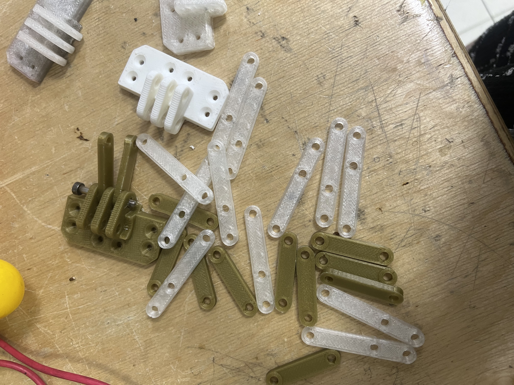
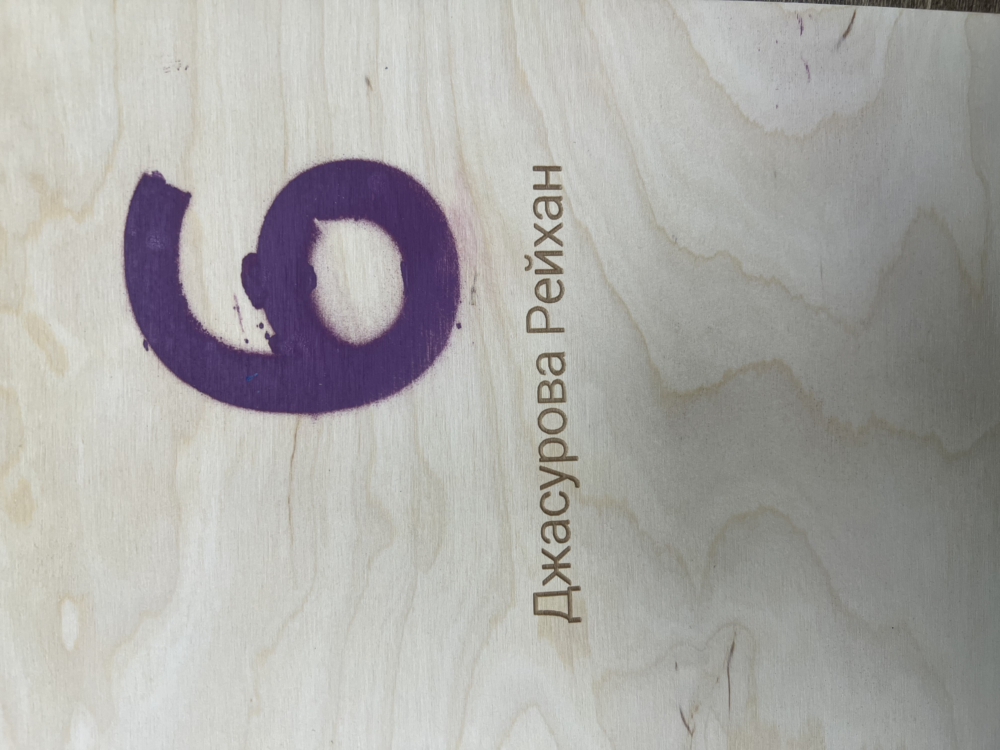
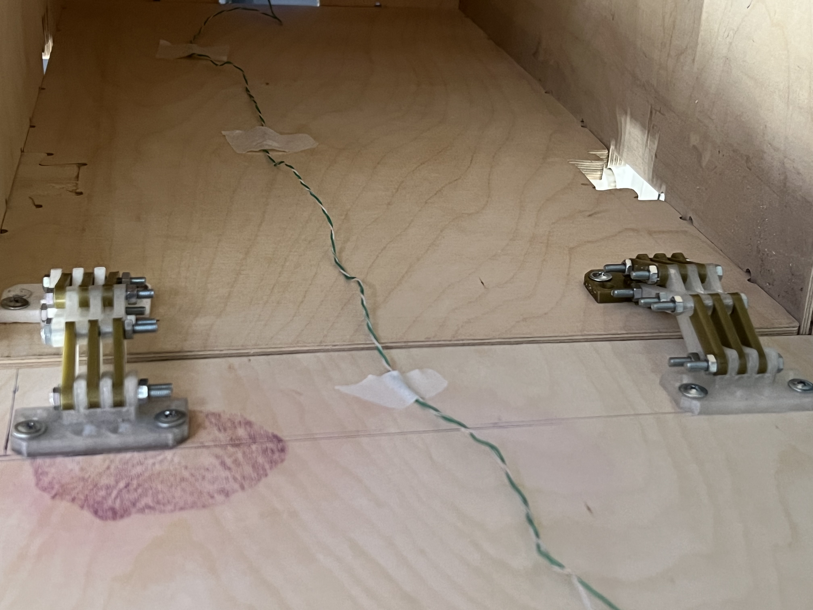
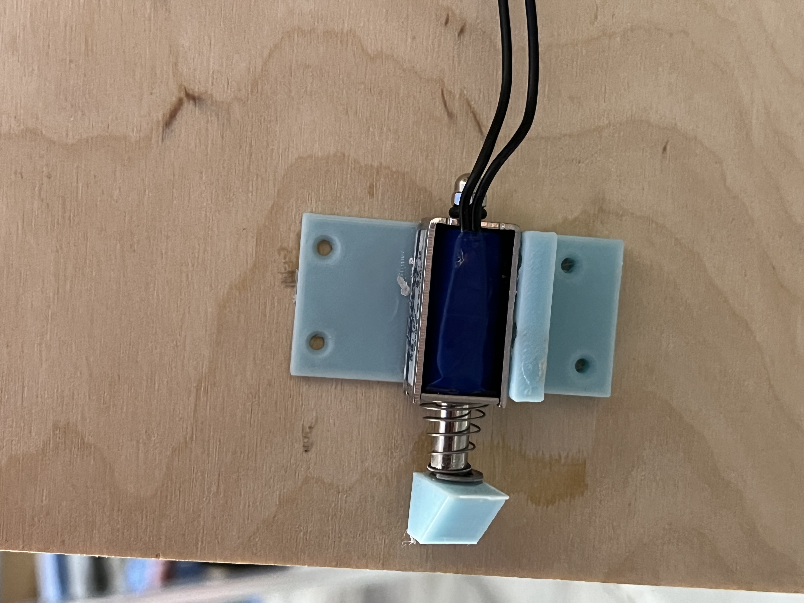

# door6

Для двери мы сначала фрезировали дерево.

Печатали на 3D принтер крепление для замка и петли для крепления двери к стеллажу.

Нанесли индекс на дверцу с помощью краски и трафарета.

Трафарет изготовле из фонеры лазерной резкой.

Имя под номером нанесли лазерной гравировкой

Закрепили петли

Замок закреили с внутренней стороны двери

